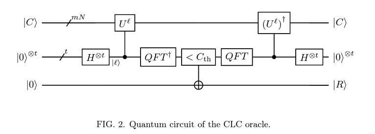

# Grover TSP
Recreating https://arxiv.org/abs/2212.02735 in Pennylane. We attempt to use Grover's Adaptive Search (GAS) to get a quicker solution to the Travelling Salesman Problem (TSP).

## Contents
1. [Installation](#installation)
1. [Background](#background)
2. [Basic Structure](#basic-structure)
3. [Oracle(s) implementation](#oracles-implementation)
4. [Problem Encoding](#problem-encoding)
5. [Oracle Implementation](#oracles-implementation)
    - [Cycle Length Comparing](#cycle-length-comparing)
    - [Hamiltonian Cycle Detection](#hamiltonian-cycle-detection)
6. [Testing](#testing)
7. [Algorithm Analysis](#algorithm-analysis)
8. [Current Tasks](#current-tasks)
9. [Milestones](#milestones)

## Installation
Create a virtual environment in Python 3.11 and install the required packages <!-- Double check if lower versions of python can work -->
```
python -m venv .venv
pip install -r requirements.txt
```

## Background
The travelling salesman problem (TSP) determines a path in a graph that traverses through every node once, and returns to the starting point at the lowest cost/distance. This means that the algorithm is required to detect a Hamiltonian cycle in the graph, and to determine the cycle with the lowest total sum. As a result, TSP is an NP-hard problem, and the decision problem of TSP (for threshold $\leq k$) is NP-complete. TSP has many applications in (look for sectors), and it is desirable to reduce the runtime of the algorithm as much as possible.

Grover's Algorithm is an efficient database search algorithm developed in the 1990s, with its claim that the runtime is $O(\sqrt{N})$, where N represents the total number of states. Grover's algorithm consists of ...

As Grover's Algorithm only brings a quadratic speedup in runtime, the algorithm does not run in polynomial time. Nevertheless, any significant speedup is worth investigating.
## Basic Structure

## Problem Encoding
For an $N$-city TSP, there are at most $d\leq N-1$ choices for the salesman at each city. To encode the cities and the choices, we would require $Nm$ qubits, where $m = \lceil\log d\rceil$, which we refer as the Cycle Register $\ket{C}$.

Note: self edges and non-existing edges are represented by infinite costs. In addition,
there needs to be a mapping between the choice index for each city, and the actual other city (ie actual choice) to go to.
## Oracle(s) implementation
The oracle is responsible for picking out a valid hamiltonian cycle that has the shortest total distance. Thus, 2 constraints come into play here - existence of hamiltonian cycle, and the cycle length/distance.

Here, 2 different oracles come into play. The cycle length comparing (CLC) oracle would be used to limit the length of the cycle to $C_{th}$, and hamiltonian cycle detector (HCD) oracle checks that the choices form a hamiltonian cycle. An AND gate
is then applied to the result of both oracles.
### Cycle Length Comparing
Note: Update threshold from sampled results. Question: how to ensure $C_{th}$ is lower than all other suboptimal solution (without knowing the solution)?
- Turn TSP into a decision problem for a specific threshold, and then conduct binary search till a single optimal solution is found.

Set precision of iQFT to 6.

Goal: to calculate the cost of a path (or cycle), and compare it with a threshold $C_{th}$. The cost is calculated by

$$\text{cost}(\ket{C})=\sum_{j=0}^{N-1}a_{j, P_j[C_j]}$$

This cost computation module is determined by a $U$ operator defined later.

Then, a quantum comparator is implemented to compare the total cost of a path with threshold $C_{th}$.

Lastly, the intermediate ancillary qubits are freed up for reuse by mirrored gates.

#### Diagram


#### Preprocessing
- Set max cycle length to $2\pi$ (iQFT compatibility)
- Normalize adj matrix by sum of all entries (mult by $2\pi$)

#### Cost Computation Module (U-operator)
- Construct controlled U-operators recursively
$$U_j = \text{diag}(\text{exp}(i\theta_{j, 0}), ..., \text{exp}(i\theta_{j, 2^m-1}))$$
$$\theta_{j,k}= a_{j,P_j[k]}$$
- Different path choices introduces different phase shifts (based on the cost)
$$U_j\ket{C_j} = \text{exp}(i\theta_{j, C_j})\ket{C_j}$$
- TODO
#### Quantum Comparator
The paper states that such a comparator is already implemented in Qiskit. (Goal: find out how the quantum comparator is implemented, and implement in Pennylane)
#### Steps to Implement
- Preprocess the input
- Apply iQFT
- TODO

### Hamiltonian Cycle Detection

TODO

## Testing
Generate $N$ data points in $[0,1]^2$ square, and edge weight is the Euclidean distance between nodes (2-norm).

TODO

## Algorithm Analysis
Qubit usage increases by $\mathcal{O}(N\log N)$ with a small constant factor guaranteed by qubit-saving techniques.

TODO

## Current Tasks
### CLC Oracle
- Implement iQFT in Pennylane
- Figure out how the quantum comparator is implemented in qiskit, and port to pennylane
- Figure out how the U-operator is implemented
### HCD Oracle
- Learn how the F-index forwarder is implemented
- Implement the OR-gates
- Understand the anchor qubit strategy

## Milestones
- Create graph generator :heavy_check_mark:
- Create the quantum encoding for the nodes and city choices
- Finish the HCD oracle, allowing the algo to check for Hamiltonian cycles
- Understand QFT (and iQFT) to apply to CLC oracle
- Solve the decision problem for TSP
- Apply the decision problem to find a solution for TSP